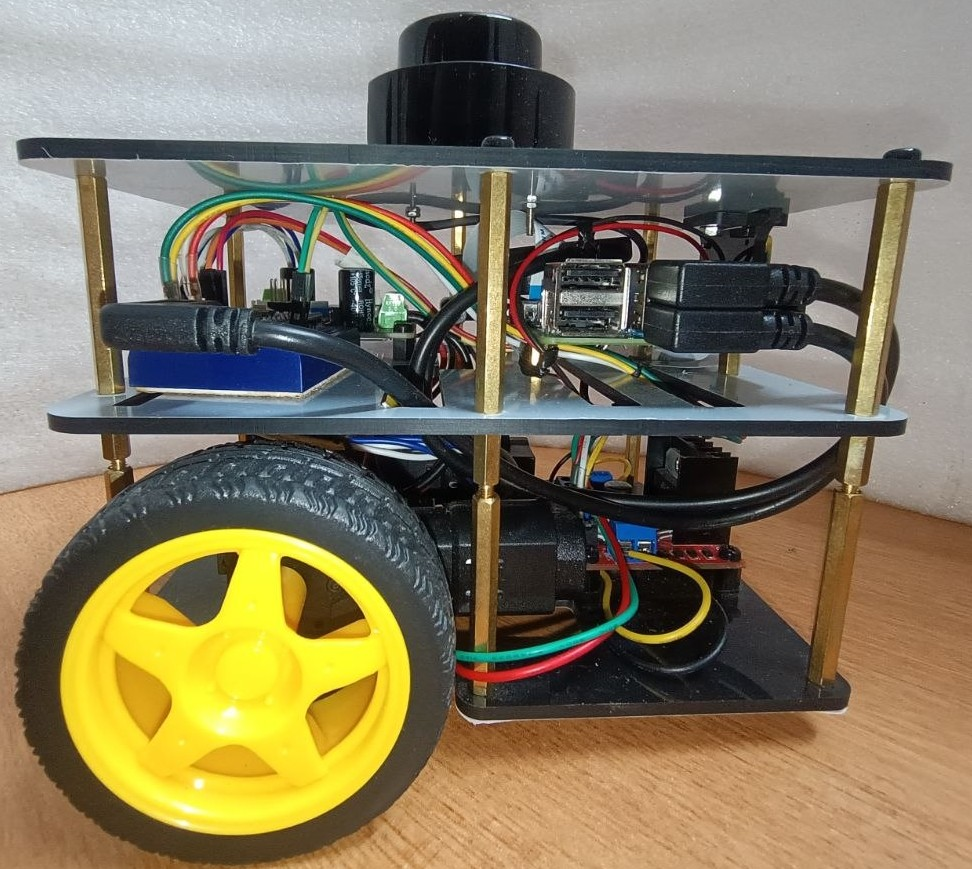
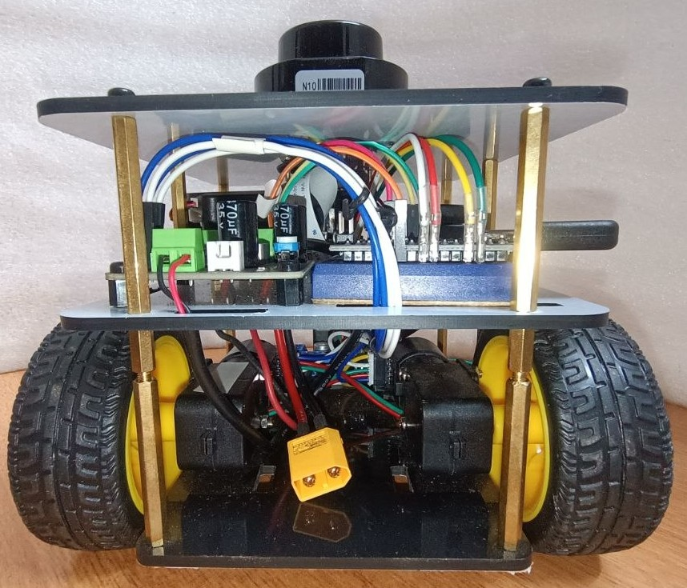
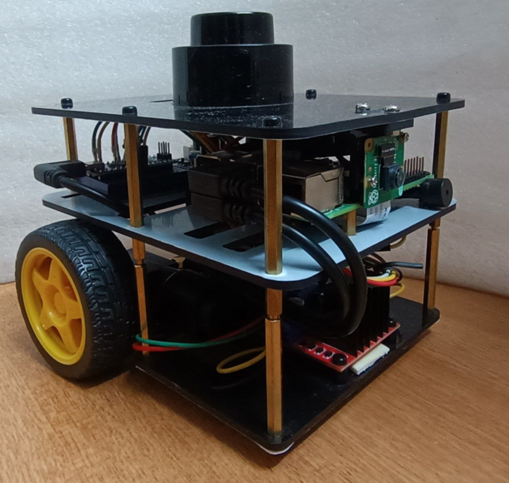

# Fastbot ROS2

[](https://docs.ros.org/en/humble/)
[](https://opensource.org/licenses/MIT)
[](https://www.raspberrypi.org/)

Implementing ROS2 enabled mobile robot (**FastBot**) — a differential drive robot with LiDAR and camera integration, built on Raspberry Pi with ROS2 Humble.

---

## Table of Contents
- [Overview](#overview)
- [Packages](#packages)
- [Requirements](#requirements)
- [Setup](#setup)
- [Launching the Robot](#launching-the-robot)
- [Expected Output](#expected-output)
- [Troubleshoot](#troubleshoot)
- [Additional Usage](#additional-usage)

---

## Overview

This repository contains all ROS2 packages required to bring up the Fastbot robot drivers, including motor control, LiDAR sensing, and camera streaming. It is the student submission for **Checkpoint 20** of The Construct's ROS2 Masterclass.

<p align="center">
  
  
  
</p>

---

## Packages

### `fastbot_bringup`
System-level launch package that starts all robot drivers in one command.
- `bringup.launch.xml` — main launch file that starts motors, LiDAR, and camera together

### `serial_motor`
Python-based differential drive motor controller communicating over serial (USB) to an Arduino Nano.
- Subscribes to `/fastbot/cmd_vel` (`geometry_msgs/Twist`)
- Publishes odometry data

### `serial_motor_msgs`
Custom ROS2 message definitions used by the serial motor driver.

### `fastbot_description`
URDF/Xacro robot model and 3D meshes for visualization in RViz2.

### `lslidar_driver`
ROS2 driver for the Leishen N10 LiDAR sensor.
- Publishes to `/scan` (`sensor_msgs/LaserScan`)

### `fastbot_gazebo`
Gazebo simulation environment (for simulation use, not required for real robot bringup).

---

## Requirements

### Hardware
- Raspberry Pi 4 (5 didn't had support for ubuntu 22.4)
- Arduino Nano (flashed with `ros_arduino_bridge` firmware)
- Leishen N10 LiDAR
- Raspberry Pi Camera (V4L2 compatible)
- Differential drive motors with encoders

### Software
- Ubuntu Server 22.04 LTS
- ROS2 Humble
- Python 3.10+

### ROS2 Dependencies
```bash
sudo apt install -y \
  ros-humble-v4l2-camera \
  ros-humble-image-transport-plugins \
  ros-humble-diagnostic-updater \
  ros-humble-pcl-conversions \
  v4l-utils \
  libboost-all-dev \
  libpcl-dev \
  libpcap-dev
```

---

## Setup

### Build the workspace
Make sure coloning is done inside `~/ros2_ws/src/`, and then build it

```bash
cd ~/ros2_ws
colcon build
source install/setup.bash
```

### Set up udev rules (for consistent device naming)

##### Arduino setup:

This setup uses Arduino Nano and by default its pointed to `/dev/ttyUSB0`. If there is any change like ttyAMC0, or somethinge else, make necessary changes inside the serial_motor package.

##### Lidar setup:

Create a udev rule for consistant device port name and later identification under `/etc/udev/rules.d/lslidar.rules`

> [!WARNING]
> Before editing you need to fetch your Lidars Vendor and Product id. Try with `lsusb`, `dmesg` etc,

```bash
SUBSYSTEM=="tty", ATTRS{idVendor}=="10c4", ATTRS{idProduct}=="ea60", SYMLINK+="lslidar"
```

And then reload newly created udev rules

```bash
sudo udevadm control --reload-rules
sudo udevadm trigger
```

verify using

```bash
ls -l /dev/lslidar
```

### Enable camera (legacy driver)

We will not be using pis `bcm2835-unicam` driver as this is not compatible with `ros2_v4l2_camera`.
For which we will moving towards `bm2835 mmal` instead. Edit `/boot/firmware/config.txt` and make sure the below changes reflects as same. Finally reboot to make the changes to effect.

```bash
# Set: camera_autodetect=0
# Add: start_x=1
```

Test the change
```bash
$ v4l2-ctl -D
Driver Info:
    Driver name      : bm2835 mmal
    Card type        : mmal service 16.1
    Bus info         : platform:bcm2835-v4l2-0
    Driver version   : 5.15.173
    Capabilities     : 0x85200005
        Video Capture
        Video Overlay
        Read/Write
        Streaming
        Extended Pix Format
        Device Capabilities
    Device Caps      : 0x05200005
        Video Capture
        Video Overlay
        Read/Write
        Streaming
        Extended Pix Format
```
---

## Launching the Robot

### Full bringup (motors + LiDAR + camera)

```bash
source ~/ros2_ws/install/setup.bash
ros2 launch fastbot_bringup bringup.launch.xml
```

This single command starts:
- Serial motor driver → connects to `/dev/arduino_nano`
- LSlidar N10 driver → connects to `/dev/lslidar`
- Raspberry Pi camera via V4L2

---

## Expected Output

After running the bringup launch, the following topics should be active:

| Topic | Message Type | Description |
|---|---|---|
| `/fastbot/cmd_vel` | `geometry_msgs/Twist` | Motor velocity commands |
| `/scan` | `sensor_msgs/LaserScan` | LiDAR scan data |
| `/fastbot_camera/image_raw` | `sensor_msgs/Image` | Camera image stream |

### Verify topics are running

```bash
ros2 topic list
```

### Verify LiDAR data

```bash
ros2 topic echo /scan
```

### Verify camera stream

```bash
ros2 topic echo /fastbot_camera/image_raw
```

---

## Troubleshoot

##### Arduino:
- Check for right device, baud rate
- test them with any serial monitoring tools
  - for open loop, send the command `o 20 0`(Left wheel forward spin) or `o 0 -20`(Right wheel backward spin)
  - for closed loop, instead of `o`, `m`. And for both cases values can be `0`(Stop) to `255`(High velocity)

##### Camera feed:
View the camera feed using `rqt_image_view`
```bash
ros2 run rqt_image_view rqt_image_view /fastbot_camera/image_raw
```

##### Lidar:
- Check if the frame name that matches inside the `lslidar_driver`'s configuration files(`params`)

## Additional Usage

### Teleoperate the robot

```bash
ros2 run teleop_twist_keyboard teleop_twist_keyboard \
  --ros-args --remap cmd_vel:=/fastbot/cmd_vel
```

### Visualize in RViz2

```bash
# From ros2 installed local machine
ros2 launch fastbot_description display.launch.py
```


### Simulation (Gazebo)

```bash
ros2 launch fastbot_gazebo one_fastbot_warehouse.launch.py
```

---
